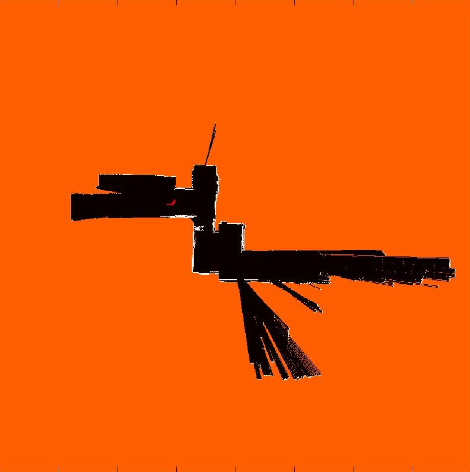
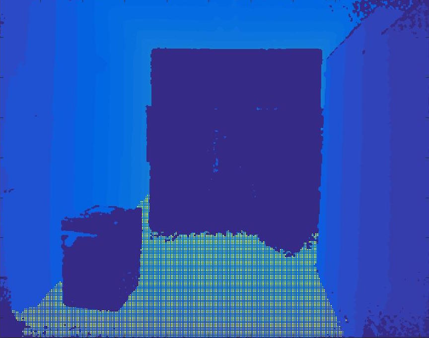

## Particle-filter based Simultaneous Localization And Mapping (SLAM)

UPenn ESE 650 Learning in Robotics, Project 4: Particle-filter based 2D SLAM.

- The project description is at [report/project4_luyiren.pdf](report/project4_luyiren.pdf)

### Code

- `slam_2.m`: SLAM code
- `ground_detection.m`: ground detection code
